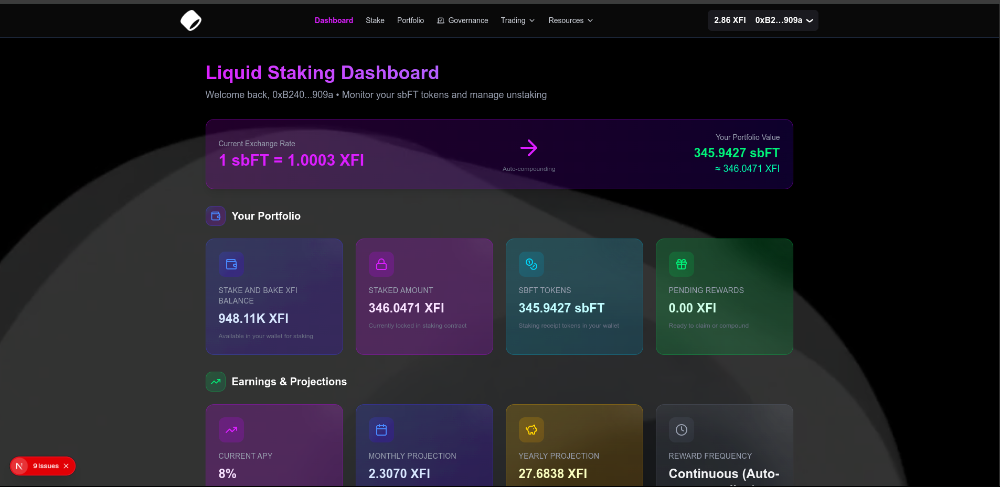
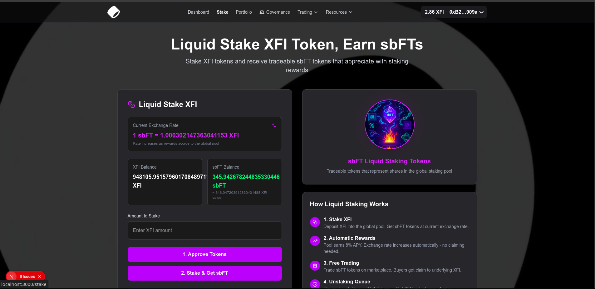
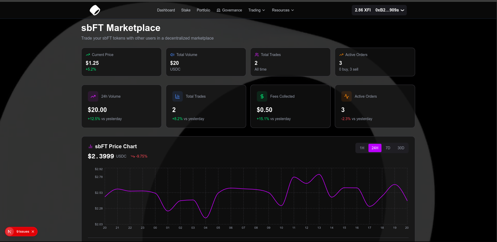
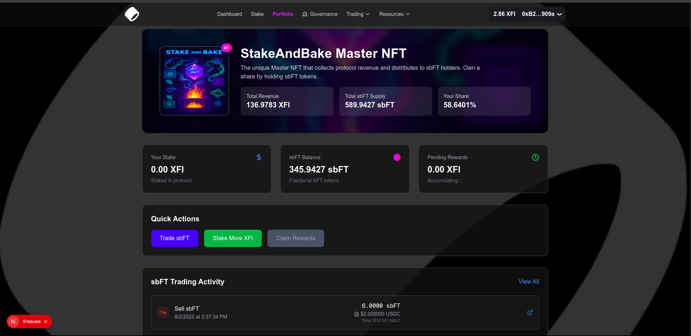

# Stake and Bake - Liquid Staking Platform

[](https://stakeandbake.vercel.app/)
[](https://vercel.com)
[](https://opensource.org/licenses/MIT)

> A next-generation liquid staking platform for the Base ecosystem that allows users to stake XFI tokens and receive liquid sbFT tokens with automatic compounding rewards through an appreciating exchange rate.

## Table of Contents

- [Overview](#overview)
- [Platform Innovation](#platform-innovation)
- [Features](#features)
- [Demo](#demo)
- [Faucet](#faucet)
- [Getting Started](#getting-started)
- [Core Mechanics](#core-mechanics)
- [Reward System](#reward-system)
- [Unstaking Options](#unstaking-options)
- [Marketplace](#marketplace)
- [Governance](#governance)
- [Installation](#installation)
- [Smart Contract Integration](#smart-contract-integration)
- [Architecture](#architecture)
- [Development](#development)
- [Deployment](#deployment)
- [Contributing](#contributing)
- [Security](#security)
- [FAQ](#faq)
- [License](#license)
- [Support](#support)

## Overview

FluidStake is a revolutionary **liquid staking protocol** built for the Base ecosystem. Unlike traditional staking platforms, users receive liquid sbFT tokens that automatically appreciate in value through an increasing exchange rate, providing seamless compounding without manual claiming while maintaining full liquidity.

### Key Innovation: Liquid Staking with Auto-Compounding

Traditional staking locks your tokens and requires manual reward claiming. Stake and Bake gives you:
- **Liquid sbFT tokens** that can be traded anytime
- **Automatic 8% APY** through exchange rate appreciation
- **No manual claiming** - rewards compound continuously
- **Multiple exit strategies** for maximum flexibility

## Platform Innovation

### 🔄 How It Works
1. **Stake XFI** → Receive liquid sbFT tokens at current exchange rate
2. **Exchange rate appreciates** → Your sbFT tokens become worth more XFI over time
3. **No action required** → Rewards compound automatically every second
4. **Stay liquid** → Trade, unstake, or hold as you prefer

### 📈 Exchange Rate Magic
```
Initial: 1 sbFT = 1.0 XFI
After 1 month: 1 sbFT = 1.067 XFI
After 1 year: 1 sbFT = 1.08 XFI (8% APY)
```

Your sbFT tokens continuously increase in XFI value without any manual intervention.

## Features

- 🔄 **Liquid Staking**: Receive tradeable sbFT tokens instead of locked stakes
- 📈 **Auto-Compounding**: 8% APY through automatic exchange rate appreciation
- ⚡ **Multiple Unstaking Options**: Regular (7-day), emergency (instant), or marketplace trading
- 💰 **Dual Reward Streams**: Exchange rate appreciation + Master NFT revenue distributions
- 🏛️ **Governance Rights**: Vote on protocol decisions with your sbFT tokens
- 🛒 **Built-in Marketplace**: Trade sbFT tokens for immediate liquidity
- 🔒 **Secure & Transparent**: Built with security and transparency as core principles
- 📱 **Responsive Design**: Seamless experience across desktop and mobile devices
- ⚡ **Real-time Updates**: Live tracking of exchange rates and pool metrics

## Demo

### Live Application
🌐 **[Visit Stake and Bake](https://stakeandbake.vercel.app/)**

## Faucet

### Custom xfi token faucet for Stake And Bake
🌐 **[cXFI Token Faucet](https://xfi-faucet.vercel.app/)**

### Screenshots

#### Main Dashboard

*Real-time exchange rate and auto-compounding rewards*

#### Liquid Staking Interface

*Stake XFI and receive liquid sbFT tokens*

#### Marketplace

*Trade sbFT tokens for immediate liquidity*

#### Portfolio Management

*Manage your liquid staking positions*

## Getting Started

### Prerequisites

Before you begin, ensure you have:

- **Web3 Wallet**: MetaMask or compatible wallet
- **XFI Tokens**: Available in your wallet for staking
- **Network Access**: Connected to the appropriate blockchain network
- **Modern Browser**: Chrome, Firefox, Safari, or Edge

### Quick Start

1. **Visit the Application**: Go to [stakeandbake.vercel.app](https://stakeandbake.vercel.app/)
2. **Connect Wallet**: Click "Connect Wallet" and approve the connection
3. **Stake XFI**: Enter the amount of XFI tokens you want to stake
4. **Receive sbFT**: Get liquid sbFT tokens that appreciate automatically
5. **Earn Continuously**: Watch your sbFT value grow with the exchange rate
6. **Exit Flexibly**: Unstake regularly, instantly, or trade on marketplace

## Core Mechanics

### 🏊 Pool System

The platform operates on a unified pool model:

```
Total XFI Pool = All Staked XFI + Accrued Rewards - Pending Unstakes
Available Liquidity = Total Pool - Pending Unstakes
Exchange Rate = Total XFI Pool / Total sbFT Supply
```

### 💰 Fee Structure

#### Staking Fee: 1%
- Deducted when staking XFI tokens
- Example: Stake 100 XFI → Pay 1 XFI fee → 99 XFI enters pool
- Fees fund Master NFT revenue distributions

#### Emergency Unstaking Penalty: 5-25%
- User-selectable penalty for instant unstaking
- Higher penalty = immediate liquidity
- Penalty goes to protocol revenue

#### Trading Fee: 2.5%
- Applied to marketplace transactions
- Ensures sustainable liquidity provision

## Reward System

### 🚀 Primary Rewards: Auto-Compounding (8% APY)

**How It Works:**
- Rewards are **NOT** distributed as separate tokens
- Instead, the exchange rate increases continuously
- Your sbFT tokens automatically become worth more XFI

**Calculation:**
```solidity
rewardAmount = (totalXFIInPool * 8% * timeElapsed) / (secondsPerYear)
newExchangeRate = totalXFIPool / totalsbFTSupply
```

**Benefits:**
- ✅ No gas fees for claiming
- ✅ No need to remember to compound  
- ✅ Seamless passive income
- ✅ Compounds every second

### 💎 Secondary Rewards: Master NFT Distributions

**Revenue Sources:**
- 1% staking fees
- Emergency unstaking penalties  
- Marketplace trading fees

**Distribution:**
- Weekly revenue sharing to sbFT holders
- Claim rewards in XFI tokens
- Proportional to your sbFT balance
- Separate from automatic exchange rate appreciation

## Unstaking Options

### 1. 🕐 Regular Unstaking (7-day delay)
- **Process**: Request unstake → Wait 7 days → Claim XFI
- **Advantage**: Get full value at current exchange rate
- **Cost**: No penalty, just time

### 2. ⚡ Emergency Unstaking (Instant)
- **Process**: Pay 5-25% penalty → Get XFI immediately
- **Advantage**: Instant liquidity for urgent needs
- **Cost**: User-selectable penalty (5-25%)

### 3. ❌ Cancel Unstake Request
- **Process**: Cancel during 7-day period → Get sbFT back
- **Advantage**: Useful if exchange rate improved
- **Cost**: None

### 4. 🛒 Marketplace Trading
- **Process**: Sell sbFT for USDC on built-in marketplace
- **Advantage**: Market-driven pricing, immediate settlement
- **Cost**: 2.5% trading fee

## Marketplace

### 🎯 Order Types

**Buy Orders:**
- Lock USDC to purchase sbFT
- Set your desired price
- Automatic matching when available

**Sell Orders:**  
- Lock sbFT to sell for USDC
- Price discovery mechanism
- Partial fills supported

### 💱 Why Trade sbFT?

- **Immediate Liquidity**: No waiting periods
- **Price Arbitrage**: Market price may differ from exchange rate
- **Flexible Exit**: Alternative to formal unstaking
- **Trading Opportunities**: Buy low, sell high

## Governance

### 🗳️ Voting Power
- Based on sbFT token holdings
- More sbFT = More voting influence
- Participate in protocol decisions

### 📋 Proposal Types
1. **Reward Rate Adjustments** (APY changes)
2. **Fee Structure Updates** 
3. **Protocol Parameter Changes**
4. **General Governance Decisions**

### ⚖️ Voting Process
- **Duration**: 7-day voting period
- **Quorum**: 10% of total sbFT supply
- **Threshold**: Simple majority wins

## Installation

### For Developers

```bash
# Clone the repository
git clone https://github.com/DIFoundation/StakeAndBake.git
cd StakeAndBake

# Install dependencies
npm install
# or
yarn install

# Set up environment variables
cp .env.example .env.local
# Edit .env.local with your configuration

# Run the development server
npm run dev
# or
yarn dev
```


## Smart Contract Integration

### Contract Addresses

```javascript
// Contract addresses 
const CONTRACTS = {
  XFI_TOKEN: "0xF321b818669d56C8f11b3617429cD987c745B0D2",        // XFI Token Contract
  LIQUID_STAKING: "0x9b5ff784A1bd9863Bb5accBE6508Cef544d497eB",   // Main Liquid Staking Contract  
  SBFT: "0x9c020d7AF67aB9B77488E9554bC09dDBB2348535",             // sbFT Token Contract
  MARKETPLACE: "0x20Fb97286Bb548b10A9238b50B623Fc20F76948E",      // sbFT Marketplace Contract
  MASTER_NFT: "0x9F69a019DC9F4a4A30a255B572E7F425a7814637",       // Master NFT Revenue Contract
  GOVERNANCE: "0x55DAe23e3c48d5c71BbCC3FBD2Ae529dbceDD20F"        // Governance Contract
};
```

### Key Functions

#### Liquid Staking Contract
```solidity
// Core staking functions
stake(uint256 amount) // Stake XFI, receive sbFT
requestUnstake(uint256 sbftAmount) // Request regular unstake
emergencyUnstake(uint256 sbftAmount, uint256 penaltyRate) // Instant unstake
claimUnstake(uint256 requestId) // Claim after 7 days
cancelUnstakeRequest(uint256 requestId) // Cancel unstake request

// View functions
getExchangeRate() // Current sbFT to XFI rate
getPoolInfo() // Total pool size and liquidity
getUserStakeInfo(address user) // User's staking details
```

#### sbFT Token Contract
```solidity
// Standard ERC20 with additional features
balanceOf(address account) // sbFT balance
transfer(address to, uint256 amount) // Transfer sbFT
approve(address spender, uint256 amount) // Approve spending

// Reward claiming
getClaimableRewards(address user) // Check Master NFT rewards
claimRewards() // Claim revenue distribution
```

## Architecture

### Tech Stack

- **Frontend**: Next.js, React, TypeScript
- **Styling**: Tailwind CSS
- **Web3**: ethers.js / wagmi
- **State Management**: Zustand / Redux
- **Charts**: Recharts for exchange rate visualization
- **Deployment**: Vercel
- **Blockchain**: Ethereum (or compatible EVM chain)

### Project Structure

```
STAKEANDBAKE
├── Frontend
│   ├── .next
│   ├── node_modules
│   ├── public
│   ├── src
│   │   ├── app
│   │   │   ├── bridge
│   │   │   ├── dashboard
│   │   │   ├── how-it-works
│   │   │   ├── marketplace
│   │   │   ├── portfolio
│   │   │   ├── protocol
│   │   │   └── stake
│   │   │       └── page.tsx
│   │   ├── favicon.ico
│   │   ├── globals.css
│   │   ├── layout.tsx
│   │   ├── page.tsx
│   │   └── sbft-placeholder.tsx
│   ├── components
│   ├── hooks
│   │   ├── useStakeAndBakeNFT.ts
│   │   └── useTransactionHistory.ts
│   ├── lib
│   │   └── contractAddressAndABI.js
│   ├── eslint.config.mjs
│   ├── next-env.d.ts
│   ├── next.config.ts
│   ├── package-lock.json
│   ├── package.json
│   ├── postcss.config.mjs
│   ├── README.md
│   └── tsconfig.json
└── SBSmart-Contract
    ├── artifacts
    ├── cache
    └── contracts

```

### Data Flow

1. **User stakes XFI** → Smart contract mints sbFT at current exchange rate
2. **Exchange rate appreciates** → sbFT value increases automatically
3. **Multiple exit options** → Regular unstaking, emergency unstaking, or marketplace trading
4. **Revenue distribution** → Master NFT rewards claimable weekly
5. **Governance participation** → Vote on proposals with sbFT tokens

## Development

### Running Locally

```bash
# Start development server
npm run dev

# Run tests
npm test

# Build for production  
npm run build

# Start production server
npm start
```

### Testing

```bash
# Run unit tests
npm run test:unit

# Run integration tests
npm run test:integration

# Run e2e tests (requires running app)
npm run test:e2e

# Test coverage
npm run test:coverage
```

### Code Quality

```bash
# Lint code
npm run lint

# Format code
npm run format

# Type checking
npm run type-check
```

## Deployment

### Vercel Deployment (Recommended)

The project is configured for seamless Vercel deployment:

```bash
# Deploy to Vercel
vercel

# Or connect your GitHub repo to Vercel for automatic deployments
```

### Manual Deployment

```bash
# Build the project
npm run build

# Deploy the 'out' or '.next' directory to your hosting provider
```

## Contributing

We welcome contributions to Stake and Bake! Please follow these steps:

1. **Fork the repository**
2. **Create a feature branch**: `git checkout -b feature/amazing-feature`
3. **Make your changes** and add tests
4. **Commit your changes**: `git commit -m 'Add amazing feature'`
5. **Push to the branch**: `git push origin feature/amazing-feature`
6. **Open a Pull Request**

### Development Guidelines

- Follow the existing code style and conventions
- Write tests for new features
- Update documentation as needed
- Ensure all tests pass before submitting PR
- Keep commits atomic and well-described

## Security

### Smart Contract Security

- All contracts should be audited before mainnet deployment
- Use established patterns and libraries (OpenZeppelin)
- Implement proper access controls and validation
- Regular security reviews and updates

### Liquid Staking Security

- Exchange rate manipulation protection
- Pool liquidity safeguards
- Emergency pause mechanisms
- Multi-signature governance controls

### Frontend Security

- Validate all user inputs
- Sanitize data before display
- Use secure communication (HTTPS)
- Implement proper error handling
- Regular dependency updates

### Reporting Security Issues

If you discover a security vulnerability, please email us at [StakeAndBake Admin Email](mailto:adeniranibrahim165@gmail.com) instead of opening a public issue.

## FAQ

### General Questions

**Q: What makes this different from traditional staking?**
A: Traditional staking locks your tokens and requires manual reward claiming. Stake and Bake gives you liquid sbFT tokens that automatically appreciate in value, so you earn rewards continuously without any manual action while maintaining full liquidity.

**Q: How do I earn rewards?**
A: Simply hold sbFT tokens. The exchange rate increases automatically based on 8% APY, so your sbFT tokens become worth more XFI over time. No claiming necessary!

**Q: Can I sell my sbFT tokens anytime?**
A: Yes! sbFT tokens are fully liquid. You can trade them on our built-in marketplace, use emergency unstaking for instant XFI, or wait 7 days for regular unstaking.

**Q: What is the exchange rate?**
A: The exchange rate determines how much XFI each sbFT is worth. It starts at 1:1 and increases continuously based on 8% annual rewards. For example, after one year, 1 sbFT = 1.08 XFI.

**Q: What are Master NFT rewards?**
A: These are additional weekly distributions funded by platform fees (staking fees, trading fees, penalties). They're separate from the automatic exchange rate appreciation and must be claimed manually.

### Technical Questions

**Q: Which networks are supported?**
A: Currently supports Ethereum mainnet and testnets. Check the app for current network status.

**Q: What wallets are compatible?**
A: MetaMask, WalletConnect-compatible wallets, and other standard Web3 wallets.

**Q: How are fees structured?**
A: 1% fee when staking, 2.5% fee for marketplace trading, and 5-25% penalty for emergency unstaking (user-selectable).

**Q: How does governance work?**
A: sbFT token holders can vote on protocol proposals. Voting power is proportional to your sbFT balance. Proposals need 10% quorum and simple majority to pass.

## Comparison: Traditional vs Liquid Staking

| Feature | Traditional Staking | Stake and Bake |
|---------|-------------------|----------------|
| **Token Status** | Locked | Liquid (tradeable) |
| **Reward Claiming** | Manual | Automatic |
| **Compounding** | Manual | Automatic |
| **Exit Options** | Fixed unlock period | Multiple flexible options |
| **Liquidity** | None during lock | Full liquidity always |
| **Gas Costs** | High (frequent claiming) | Low (minimal transactions) |
| **User Experience** | Complex | Simple "set and forget" |

## License


This project is licensed under the MIT License - see the [LICENSE](LICENSE) file for details.

```
MIT License

Copyright (c) 2025 Stake and Bake Team

Permission is hereby granted, free of charge, to any person obtaining a copy
of this software and associated documentation files (the "Software"), to deal
in the Software without restriction...
```

## Support

### Issues & Bug Reports

- 🐛 **Report Bug**: [GitHub Issues](https://github.com/DIFoundation/stakeAndBake/issues)
- 💡 **Feature Request**: [GitHub Discussions](https://github.com/DIFoundation/StakeAndBake/discussions)

---

<div align="center">
  <strong>🥩 Liquid Staking Revolution 🔥</strong>
  <br>
  <sub>Stake XFI → Get liquid sbFT → Earn automatically → Stay flexible</sub>
  <br><br>
  <a href="https://stakeandbake.vercel.app/">Live App</a> •
  <a href="https://github.com/DIFoundation/StakeAndBake">GitHub</a> •
  <a href="https://xfi-faucet.vercel.app/">Get Test Tokens</a>
</div>